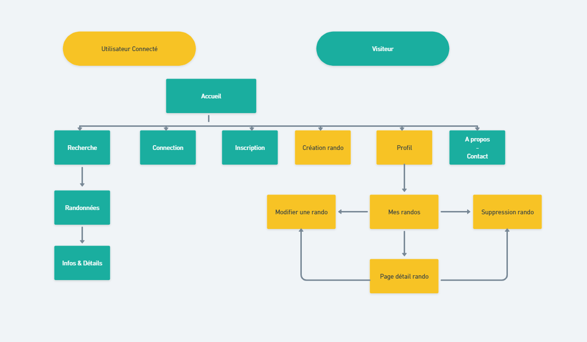

## Le cahier des charges

[Documentation projet](https://drive.google.com/drive/u/0/folders/1BGg96K2KEdEaY-ejXD6isEuPe546zlF_)

### Présentation du projet : GoForWalk

---

Application WEB pour des partages de randonnées. Cette application permet à un visiteur de rechercher des randonnées via un mot clé ( ville ), de voir en details ses informations dont un aperçu du parcours grâce à une API externe,

mais également de se créer un compte pour pouvoir créer une randonnée à son tour .

#### Fonctionnalités :

---

- Recherche de randonnées via ville

- Accèder aux détails d'une randonnée (via page résultats de recherche)

- Création de Compte

- Création de randonnée ( Informations, Photos, Itinéraires / Parcours via une API comme google maps )

- Modifier ou supprimer ses randonnées publiées (via /profil/mesRandonnées)

- Accèder et modifier à ses informations via page profil

- Suppression de Compte via page profil

#### Opportunités :

---

Ce projet peut offrir aux étudiants un assez gros projet avec des fonctionnalités basiques.

Nous allons fortement utiliser GitHub pour le versioning de notre code et utiliser divers outils.

Des réunions seront effectuées chaque semaine afin de partager nos difficultés sur du code.

_Chaque semaine sera dirigée par un étudiant différent afin que toute l'équipe réalise les difficultés de gérer le projet._

#### La définition des besoins et des objectifs du projet :

---

Le projet permet de répondre à une demande spécifique :

- Trouver des itinéraires pour effectuer des randonnées.

- Permettre aux randonneurs chevronnés de créer des randonnées afin de partager des itinéraires

- Mettre en relation la communauté de randonneurs

#### Les fonctionnalités du projet (spécifications fonctionnelles) :

---

**MVP (version 1.0) :**

- Recherche de randonnées via ville ou France entière

- Accèder aux détails d'une randonnée (via page résultats de recherche)

- Création de Compte

- Création de randonnée ( Informations, Photos, Itinéraires / Parcours via une API comme google maps )

- Modifier ou supprimer ses randonnées publiées (via /profil/mesRandonnées)

- Accèder et modifier à ses informations via page profil

- Suppression de Compte via page profil

**BONUS (version 2.0):**

- Messagerie entre membres
- Commentaires (titre, description, note)
- Recherche autour de soi
- Ajouter une photo de profil

**BONUS (version 3.0):**

Bonus Back :

- Optimisation des requêtes via fonction SQL
- Optimisation des requêtes via Index SQL
- Controle du code via test unitaire

Bonus Front :

- Typescript, code scalable
- NextJS, optimisation expérience utilisateur (navigation)
- Websocket (amélioration du contact entre membre)

#### Public visé :

---

- Randonneur occasionnel

- Randonneur chevronné

#### Les navigateurs compatibles :

---

Chrome , Firefox , Safari .

#### L'arborescence de l'application (le chemin de l'utilisateur) :

---

#### La liste des routes prévues :

---

**Route MVP :**

Route API :

Visiteur :
Se connecter (GET) :
/API/auth/login
Crée un compte (POST) :
/API/auth/register
Recherche France entière (GET) :
/API/trek/{AllTrek}
Recherche par Ville (GET):
/API/trek/{TrekByCity}
Afficher les détails d'une randonnée (GET):
/API/trek/{TrekById}

Membre :
Crée une randonnée (POST) :
/API/trek/createTrek
Mettre à jour une randonnée (PUT/PATCH):
/API/trek/{TrekById}
Supprimer une randonnée (DELETE):
/API/trek/{TrekById}
Détails page profil d'un utilisateur (GET):
/API/user/{UserById}
Modification profil d'un utilisateur (POST) :
/API/user/{UserById}
Supprimer compte utilisateur (DELETE):
/API/user/{UserById}
Voir les randonnées publiées par un utilisateur (GET) :
/API/trek/{TrekByUser}
Route FRONT :

/login

/register

/profil

/profil/myTrek

/about

/trek

/search

#### La liste des User stories :

---

Voir fichier **[userstories.md](./conception/userstories.md)**

#### La liste des rôles de chacun :

---

- [x] Product Owner / Agile : Laurent

- [x] Lead Dev Front : Dorian

- [x] Lead Dev Back : Léo

- [x] Git Master / Scrum : Franck
